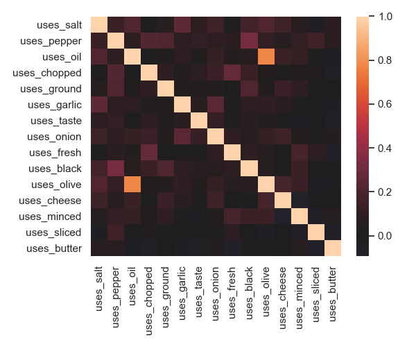
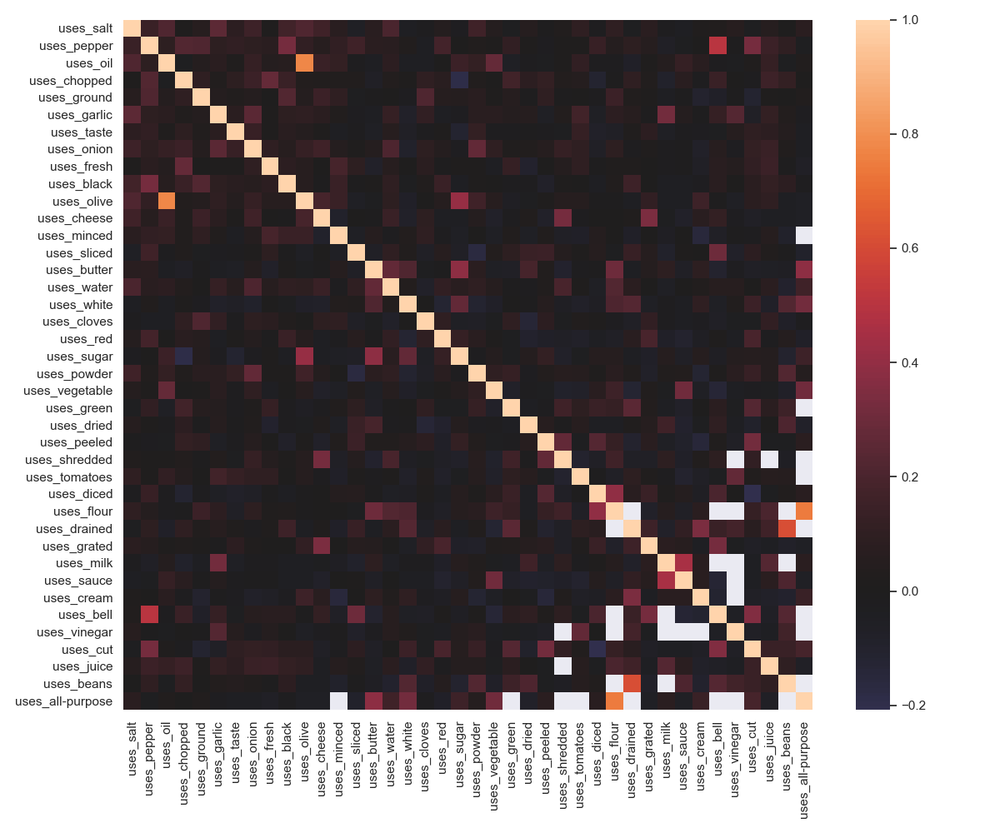

# Recipe Downloader

## Features
- Automated downloading, cleaning and storage of recipe data from online websites
- Basic exploratory data analysis
- Basic framework for making predictions of recipe ratings based on other features
- Features included in the dataset are:
    - `cook_link`: URL to the cook's webpage (if available)
    - `cook_name`: Name of the cook (if available)
    - `link`: URL to the recipe
    - `num_reviews`: Number of written reviews given to the recipe
    - `num_ratings`: Total number of ratings the recipe received
    - `[1..5]_out_of_5`: 5 columns, named `1_out_out_5` through to `5_out_of_5` giving the total number of 1..5 star ratings
    - `rating_avg`: Average of all numeric ratings given to the recipe
    - `title`: The title of the recipe
    - `prep`: Estimated prep time
    - `cook`: Estimated cooking time
    - `total`: Estimated total tiem
    - `additional`: Estimated additional time required
    - `duration`: Estimated duration for the meal. Can be inconsistent with `total`, `prep`, `cook`, or `additional`
    - `servings`: Estimated number of servings
    - `yield`: Estimated yield of the recipe
    - `calories`: Number of calories given by the recipe
    - `protein_g`: Amount of protein in grams
    - `carbohydrates_g`: Amount of carbs in grams
    - `fat_g`: Amount of fat in grams
    - `cholesterol_mg`: Amount of cholesterol in milligrams
    - `sodium_mg`: Amount of sodium in milligrams
    - `uses_[ingredient]`: many columns, indicating the count of `[ingredient]` in the ingredients list of the recipe.

## Pandas `.describe()` of the numeric columns

```
>>> df[[c for c in df.columns.to_list() if 'uses_' not in c]].describe().T[['count', 'mean', 'std', 'min', '50%', 'max']]
                  count         mean          std  min          50%      max
num_ratings      4883.0   128.079255   424.903844  0.0    33.000000  16773.0
num_reviews      4883.0    93.939996   300.039687  0.0    26.000000  11846.0
rating_avg       4645.0     0.877017     0.081881  0.2     0.888889      1.0
servings         4883.0     8.572804    10.414110  1.0     6.000000    200.0
5_out_of_5       4883.0    84.769814   335.172814  0.0    18.000000  14874.0
4_out_of_5       4883.0    29.568708    73.023106  0.0     9.000000   1305.0
3_out_of_5       4883.0     8.429859    19.945556  0.0     3.000000    352.0
2_out_of_5       4883.0     3.041982     7.620322  0.0     1.000000    164.0
1_out_of_5       4883.0     2.268892     6.746355  0.0     0.000000    174.0
calories         4876.0   268.287736   171.342403  1.0   238.000000   1499.0
protein_g        4858.0     8.528077     7.624837  0.1     6.400000     88.4
carbohydrates_g  4875.0    30.963097    22.896994  0.1    27.000000    166.2
fat_g            4832.0    13.257078    11.360381  0.1    10.500000    124.6
cholesterol_mg   2691.0    53.717503    66.576418  0.1    31.000000    636.0
sodium_mg        4877.0   469.057720   465.946812  0.1   347.000000   7499.1
```

## Pandas `.info()` of the non-`uses_*` columns

```
>>> df[[c for c in df.columns.to_list() if 'uses_' not in c]].info()
<class 'pandas.core.frame.DataFrame'>
RangeIndex: 4883 entries, 0 to 4882
Data columns (total 26 columns):
 #   Column           Non-Null Count  Dtype  
---  ------           --------------  -----  
 1   cook_link        4839 non-null   object 
 2   cook_name        4883 non-null   object 
 3   duration         4883 non-null   object 
 4   link             4883 non-null   object 
 5   num_ratings      4883 non-null   int64  
 6   num_reviews      4883 non-null   int64  
 7   rating_avg       4645 non-null   float64
 8   title            4883 non-null   object 
 9   prep             4567 non-null   object 
 10  cook             3875 non-null   object 
 11  total            4593 non-null   object 
 12  servings         4883 non-null   int64  
 13  yield            4883 non-null   object 
 14  5_out_of_5       4883 non-null   int64  
 15  4_out_of_5       4883 non-null   int64  
 16  3_out_of_5       4883 non-null   int64  
 17  2_out_of_5       4883 non-null   int64  
 18  1_out_of_5       4883 non-null   int64  
 19  calories         4876 non-null   float64
 20  protein_g        4858 non-null   float64
 21  carbohydrates_g  4875 non-null   float64
 22  fat_g            4832 non-null   float64
 23  cholesterol_mg   2691 non-null   float64
 24  sodium_mg        4877 non-null   float64
 25  additional       1179 non-null   object 
dtypes: float64(7), int64(9), object(10)
memory usage: 992.0+ KB
```

## The most used ingredients, by percentage occurance per recipe
```
>>> df[[c for c in df.columns.to_list() if 'uses_' in c]].count().sort_values(ascending=False).head(40) / len(df)
uses_salt           0.634446
uses_pepper         0.543314
uses_oil            0.513619
uses_chopped        0.509113
uses_ground         0.431702
uses_garlic         0.419210
uses_taste          0.392382
uses_onion          0.363506
uses_fresh          0.350809
uses_black          0.348761
uses_olive          0.335654
uses_cheese         0.323981
uses_minced         0.259062
uses_sliced         0.241040
uses_butter         0.229367
uses_water          0.225271
uses_white          0.222404
uses_cloves         0.221790
uses_red            0.210731
uses_sugar          0.204997
uses_powder         0.195372
uses_vegetable      0.185337
uses_green          0.182470
uses_dried          0.178169
uses_peeled         0.177964
uses_shredded       0.176531
uses_tomatoes       0.172435
uses_diced          0.168134
uses_flour          0.161376
uses_drained        0.158509
uses_grated         0.158100
uses_milk           0.153389
uses_sauce          0.135163
uses_cream          0.131477
uses_bell           0.127995
uses_vinegar        0.127586
uses_cut            0.127381
uses_juice          0.123899
uses_beans          0.116527
uses_all-purpose    0.114684
dtype: float64

```

## Correlations of the top 15 ingredients


## Correlations of the top 40 ingredients



## Future Features
